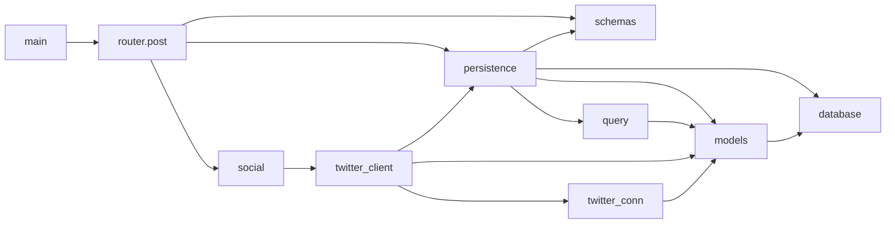

# IslabTweet

## Features

This service is meant to allow for:

1. Scheduling of posts on Twitter, including containing images and polls
2. Collecting (we refer to this as harvesting) responses both and as twitter replies and poll votes. Currently, collection of retweets with comments is not supported.

## Deployment
OpenAPI interface is accessible from ISLab VPN at http://172.20.27.81:8090
The DB is accessibile at postgres@172.20.27.81:5532/islab_tweet

User handling is performed with a mock using HTTP Basic Auth. Password is not verified, user must coincide with Twitter user.

To add a new user, its keys need to be added to the DB table socialcampaigns.setting, as [shown here](https://github.com/umilISLab/IslabTweet/blob/main/ScriptDB/z_init.sql)

# Dependency Tree

